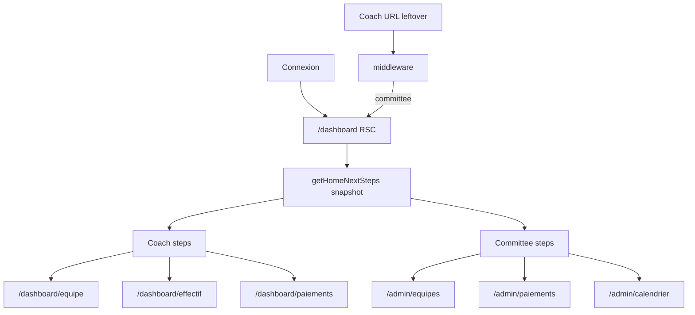

# Site usability for coaches, committee, and public - Plan

**Target repo:** `platform` (git root). Paths below are relative to that root.

## Goal Capsule

- **Objective:** Make the connected space and the public site easier for non-technical coaches, committee members, and supporters: a shared home that always shows the next action, lighter heavy workflows, and a coherent public visual system.
- **Authority:** This plan. Product choices settled in the planning session override local copy that still says “Next.js 14” or “Espace coach” for everyone.
- **Stop if:** the work adds a second committee landing, a locked wizard, online payments, a notification bell, or referee match-sheet UI.
- **Execution profile:** Five units, dependency-ordered. Prove checklist logic with Vitest before wiring the home. Public rebrand is last so dashboard copy is stable.
- **Tail ownership:** Implementer owns tests, visual smoke, and leftover coach-only links for committee.

---

## Product Contract

### Summary

Plan a role-aware shared `/dashboard` with a persistent next-step list, simpler coach and committee workflows on existing routes, and a full public visual rebrand (tokens, hero, inner pages). Do not add a separate committee home or V2 features.

### Problem Frame

Coaches and the committee already have working tools, but the site does not say what to do now.
The committee lands on a coach-centric home: fake unpaid fees, “Espace coach”, and links that middleware bounces to `/admin/equipes`.
Empty screens have no button.
Admin panels mix primary work (validate, record cash, schedule) with rare actions (reassign, unlock).
The public site mixes navy in `TOURNAMENT.brandColor`, gold hardcoded in UI, and an Unsplash stadium hero.

### Requirements

**Home and next steps**

- R1. After login, coaches and committee land on the same `/dashboard` and can return to it from the sidebar.
- R2. The home always shows a derived next-step list for the current role. Completed steps stay visible. The primary action is the first incomplete step.
- R3. Committee home must not show coach team cards, unpaid-fee fallback, or links to coach-only routes.
- R4. Coach next steps follow: create team → six players with photos → submit → wait review or fix if rejected → declare cash if approved and unpaid → done.
- R5. Committee next steps follow: submitted teams to review → cash to confirm → next match to schedule or score → done when queues are empty.

**Heavy workflows**

- R6. Keep existing coach routes for team, roster, and payments. Add a next action on every empty or blocked screen.
- R7. Keep existing admin routes. Put validate / confirm cash / schedule-or-score first. Hide reassign, unlock, and similar secondary actions behind an extra control.
- R8. Do not add online payment. Cash declaration and committee confirmation stay the payment path.

**Public visual**

- R9. Public pages (`/`, `/calendrier`, `/classement`, `/documents`, `/aide`) and auth pages that use the public chrome share one visual system: navy surfaces, gold as accent and CTA, no Unsplash hero.
- R10. Supporters can find calendar, standings, and documents without scrolling a long marketing page for the only useful facts.

**Language**

- R11. Replace committee-facing “Espace coach” and opaque labels (instruction, tranchée) with everyday French on the screens this plan touches.

### Actors

- A1. Public supporter (no account).
- A2. Coach.
- A3. Committee or super_admin.

### Key Flows

- F1. Login to shared home.
  - **Trigger:** Successful sign-in.
  - **Actors:** A2, A3
  - **Steps:** Land on `/dashboard`. See role-correct checklist. Committee can open Accueil again from the sidebar.
  - **Covered by:** R1, R2, R3
- F2. Coach dossier.
  - **Trigger:** Coach with no team or incomplete roster.
  - **Actors:** A2
  - **Steps:** Home points to team or roster. Empty screens continue the same path. Submit when six photographed players exist. After approval, home points to cash declaration.
  - **Covered by:** R4, R6, R8
- F3. Committee work queue.
  - **Trigger:** Committee opens Accueil or an admin tool.
  - **Actors:** A3
  - **Steps:** Home lists counts and the next admin URL. Validation, payments, and calendar remain the tools. Secondary actions stay available but not first.
  - **Covered by:** R5, R7
- F4. Public visit.
  - **Trigger:** Open `/` or an inner public URL.
  - **Actors:** A1
  - **Steps:** See branded hero and a short path to calendar, standings, documents, and login.
  - **Covered by:** R9, R10

### Acceptance Examples

- AE1. Covers R3. Given a committee session with no coach team. When they open `/dashboard`. Then they see queue counts, not “Aucune équipe inscrite” and not 15 000 FCFA unpaid.
- AE2. Covers R1. Given a committee user on `/admin/equipes`. When they choose Accueil. Then they reach `/dashboard`.
- AE3. Covers R4 / R6. Given a coach with a draft team and zero players. When they open Effectif. Then the empty state sends them to add a player (or to the team page if no team).
- AE4. Covers R9. Given `/` and `/connexion`. When rendered after the rebrand. Then both use the same navy/gold tokens and neither uses the Unsplash stadium image.

### Success Criteria

- A new coach can finish “what do I do now?” from the home without opening every sidebar item.
- A committee member does not hit a dead coach URL from the home.
- Public calendar and standings remain one tap from the header after the visual change.
- `npm run test` covers checklist derivation. Visual smoke covers home, one coach form, one admin panel, `/`, and `/connexion`.

### Scope Boundaries

**In scope:** shared home, checklist, empty-state CTAs, copy on touched screens, admin primary-vs-secondary layout, public visual system, middleware redirect for leftover coach URLs.

**Deferred for later:** referee/discipline home, in-app notification bell, online payments, merging team+roster into one page, React component tests / RTL.

**Outside this product's identity:** native apps, WhatsApp API, social feed.

**Deferred to Follow-Up Work:** replacing every hardcoded `#d4af37` in unused dashboard corners if the public pass already centralizes tokens; preview-mode committee persona.

### Key Decisions

- Shared connected home for coaches and committee, not a separate committee landing. Governs R1, R3. (session-settled: user-directed — chosen over a dedicated committee work-queue home: keep one accueil, make it clearer)
- Guidage plus simplification of heavy flows. Governs R2, R4, R5, R6, R7. (session-settled: user-directed — chosen over guidage-only, simplify-only, or brainstorm-first)
- Public site included as a full visual rebrand. Governs R9, R10. (session-settled: user-directed — chosen over authenticated-only, then over copy-only public polish)

---

## Planning Contract

### Key Technical Decisions

- KTD1. Derive next steps in a pure function from a snapshot (team, roster counts, payment status, admin queues). Render on the RSC home. Do not persist checks. (session-settled: user-directed — chosen over a locked wizard: list stays on the home)
- KTD2. Branch `/dashboard` on `isCommitteeRole`. Skip `getCoachTeam` / `getCoachPaymentSummary` / unpaid fallback for committee. Eyebrow uses `section="admin"` for committee.
- KTD3. Add Accueil (`/dashboard`) as the first admin nav item. Change middleware so committee hitting coach-only prefixes redirect to `/dashboard`, not `/admin/equipes`.
- KTD4. Do not merge coach routes. Simplify by checklist + empty-state `action` slot + shorter copy.
- KTD5. Visual tokens: navy `#1A3A6B` for public surfaces and hero wash; gold `#d4af37` for CTA and accent. Put colors in CSS variables. Replace Unsplash hero with a local or solid branded treatment.
- KTD6. Test checklist and redirect rules in existing Node Vitest. Do not add RTL for this plan. UI proof is a short smoke list.

### High-Level Technical Design

### Assumptions

- Persistent list means always visible with completed items checked, not a one-shot tour.
- “Refonte visuelle complète” means a coherent public system (tokens, hero, inner headers), not a new third palette or a designer file.
- Super_admin follows committee home rules.

### Sequencing

U1 → U2 (home + nav + middleware) → U3 and U4 in either order → U5 last.

### Product Contract preservation

Product Contract created in this bootstrap. No upstream brainstorm IDs to preserve.

---

## Implementation Units

### U1. Next-step derivation

**Goal:** Encode role next steps in a testable lib.
**Requirements:** R2, R4, R5
**Dependencies:** none
**Files:**
- `src/lib/home-next-steps.ts` (create)
- `src/lib/home-next-steps.test.ts` (create)
**Approach:**
1. Input a snapshot: role, team status, player count, photo completeness, payment status, submitted-team count, pending-cash count, next match needing schedule or score.
2. Output ordered steps with id, label, href, done.
3. Coach and committee lists per R4 and R5. Rejected team reopens submit after roster/team fix.
**Patterns to follow:** `src/lib/tournament-rules.ts` plus colocated `*.test.ts`.
**Execution note:** Implement new domain behavior test-first.
**Test scenarios:**
- Coach with no team: first incomplete step href is `/dashboard/equipe`.
- Coach with draft, five photographed players: first incomplete is effectif (sixth player), not submit.
- Coach approved and unpaid: first incomplete is `/dashboard/paiements`.
- Committee with two submitted teams: first incomplete href is `/admin/equipes`.
- Committee with empty queues: all steps done.
**Verification:** `npm run test` includes the new file. Types export a stable snapshot shape for the home page.

### U2. Shared home, Accueil nav, middleware

**Goal:** Make `/dashboard` honest for both roles and reachable for committee.
**Requirements:** R1, R2, R3, R11. AE1, AE2. KTD2, KTD3
**Dependencies:** U1
**Files:**
- `src/app/(dashboard)/dashboard/page.tsx`
- `src/components/layout/dashboard-shell.tsx`
- `src/components/layout/dashboard-page-header.tsx`
- `src/middleware.ts`
- `src/components/dashboard/home-next-steps.tsx` (create, server-friendly)
- `src/app/(auth)/connexion/page.tsx` (login copy for both roles)
**Approach:**
1. Committee: queue queries only. No coach cards. No unpaid fallback.
2. Coach: keep alerts and stats. Checklist above the cards.
3. First admin link is Accueil → `/dashboard`. Active state: prefix match for nested admin URLs; `/dashboard` exact.
4. Middleware committee on coach-only prefixes → `/dashboard`.
**Patterns to follow:** existing `isCommitteeRole` in `src/lib/roles.ts` and `requireAuth` on the page.
**Test scenarios:**
- Test expectation: none for JSX — covered by U1 plus smoke.
- Integration: committee bookmark `/dashboard/equipe` ends on `/dashboard`.
**Verification:** Smoke as coach (checklist + team cards) and as committee (no 15 000 FCFA card, Accueil in sidebar, admin CTAs only).

### U3. Coach empty states and funnel copy

**Goal:** Every blocked coach screen names the next tap.
**Requirements:** R6, R8, R11. AE3
**Dependencies:** U2
**Files:**
- `src/components/layout/dashboard-empty-state.tsx`
- `src/components/dashboard/team-form.tsx`
- `src/components/dashboard/roster-manager.tsx`
- `src/app/(dashboard)/dashboard/paiements/page.tsx`
- `src/components/dashboard/declare-payment-button.tsx`
**Approach:**
1. Add optional `action` (href + label) to `DashboardEmptyState`.
2. No team on effectif or paiements → CTA to `/dashboard/equipe`.
3. Team without players → CTA to add a player.
4. Shorten payment copy: cash to the committee, then declare. Keep `DeclarePaymentButton`.
**Patterns to follow:** `ButtonLink` on dashboard pages.
**Test expectation:** none — styling and copy. Smoke the three coach screens.
**Verification:** Empty effectif and empty paiements each show one obvious button.

### U4. Committee primary path on admin panels

**Goal:** Validation, cash, and calendar lead with the daily action.
**Requirements:** R7, R11
**Dependencies:** U2
**Files:**
- `src/components/admin/admin-teams-panel.tsx`
- `src/components/admin/admin-payments-panel.tsx`
- `src/components/admin/admin-calendar-panel.tsx`
**Approach:**
1. Teams: submitted queue first. Reassign, unlock, and full edit behind “Plus” or equivalent.
2. Payments: confirm / record cash first. History second.
3. Calendar: upcoming schedule first. Score entry on completed or in-progress matches, not mixed into create.
4. Empty admin tables use the empty-state action back to Accueil.
**Patterns to follow:** existing panel + `router.refresh()` after server actions. Do not split files unless a panel stays unreadable.
**Test expectation:** none for layout. Smoke each of the three admin pages.
**Verification:** A committee user can validate, record a payment, and add a match without opening a secondary menu first.

### U5. Public visual system

**Goal:** One navy/gold public look from landing through auth.
**Requirements:** R9, R10. AE4. KTD5
**Dependencies:** U2 (copy on login can land with U2; visual pass here)
**Files:**
- `src/app/globals.css`
- `src/lib/constants.ts`
- `src/components/landing/landing-hero.tsx`
- `src/components/landing/landing-navbar.tsx`
- `src/components/layout/public-shell.tsx`
- `src/app/page.tsx`
- `src/components/public/public-page-header.tsx`
- remaining `src/components/landing/*` and `src/components/public/*` as needed for token usage
**Approach:**
1. Define public tokens (`--public-navy`, `--gold`) and use them in `.landing-page`.
2. Replace Unsplash hero with a branded treatment (gradient + logo or local asset).
3. Keep inner public pages on `PublicShell` so they inherit tokens.
4. Surface calendar, standings, and documents in the header; do not hide them behind a long scroll only.
5. Align `TOURNAMENT.brandColor` with the navy actually used.
**Patterns to follow:** existing `.landing-page` / `.dashboard-page` split. Do not restyle dashboard chrome in this unit except shared CSS variables.
**Execution note:** This is mostly visual; prefer install/runtime smoke over unit coverage.
**Test scenarios:**
- `brandColor` equals the navy token used on the public hero.
**Verification:** Smoke `/`, `/calendrier`, `/classement`, `/connexion` on mobile width. No Unsplash hostname required for the hero.

---

## Verification Contract

| Gate | Command / check | Applies |
|---|---|---|
| Unit | `npm run test` in `platform` | U1, token constant in U5 |
| Lint | `npm run lint` | all units |
| Typecheck via build | `npm run build` before merge | all units |
| Smoke | Coach home, committee home, effectif empty, admin equipes, `/`, `/connexion` | U2–U5 |

Do not add Playwright in this plan.

---

## Definition of Done

- R1–R11 are visible in the shipped UI or covered by U1 tests.
- Committee cannot see coach unpaid fallback on `/dashboard`.
- Checklist is derived, always on the home, not a wizard.
- Public hero is branded, not Unsplash.
- `npm run test` and `npm run lint` pass.
- Abandoned experiments are not left in the diff.
- README still mentions Next 14: update that one sentence if the implementer already touches `README.md`; otherwise leave docs follow-up.

---

## Appendix

### Sources and research

- Repo patterns: `src/app/(dashboard)/dashboard/page.tsx`, `src/components/layout/dashboard-shell.tsx`, `src/middleware.ts`, `src/app/globals.css`, Vitest `src/**/*.test.ts`.
- No `docs/solutions/` corpus. Greenfield UX against current routes.
- External research skipped: local landing and dashboard patterns exist.

### Risks

- Hardcoded gold in many TSX files. U5 centralizes public tokens; leftover dashboard hex is acceptable until a later pass.
- Middleware redirect change can surprise bookmarks that expected `/admin/equipes`. Accueil in the sidebar is the recovery path.
- Preview mode still uses a coach profile. Committee visual QA needs a real committee session.
